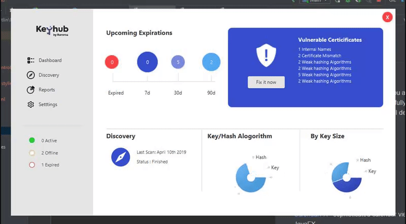

# Keyhub JavaFX

https://www.youtube.com/watch?v=C0YdOxljm1E

This project is purely JavaFX - it gives you a basis of what to do regarding your projects, 
**Note:** it is not a fully fledged system. Some of the things covered apart from UI design is

  - Adding data to Pie Chart
  - Realtime pie chart data using timeline

Watch and Subscribe on [Youtube - KeepToo](https://youtube.com/keeptoo)